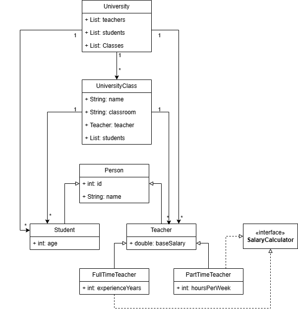

# tae-java-final-project

## University Tracking System

This repository contains the final exercise for the TAE Java Basics Module. The project consists of a management system for a university, handling teachers, students, and classes while applying core Object-Oriented Programming (OOP) principles.

---

### UML Diagram

### Program Features

The application includes a menu with the following options:
1. Displays all teachers and their data.
2. Lists all classes with a submenu to select a specific class and see its teacher and students.
3. Adds a new student to an existing class.
4. Adds a new class using an existing teacher and students.
5. Searches by student ID and lists all classes they are enrolled in.
6. Exit.

### Salary Calculation

* **Full-time Teachers:** $BaseSalary \times (1.1 \times ExperienceYears)$.
* **Part-time Teachers:** $BaseSalary \times ActiveHoursPerWeek$.

### Technical Implementation

* UML diagram included in the repository.
* OOP Principles.
* Packages and layers with proper naming, access modifiers, and constructors.
* Use of static attributes and methods.
* **Initialization:** Minimum of 4 teachers (2 per type), 6 students, and 4 classes.
* Proper use of `.gitignore`, multiple branches, and multiple commits.